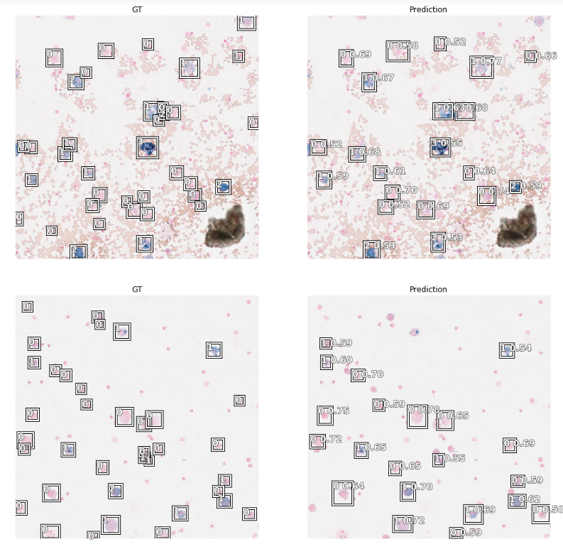
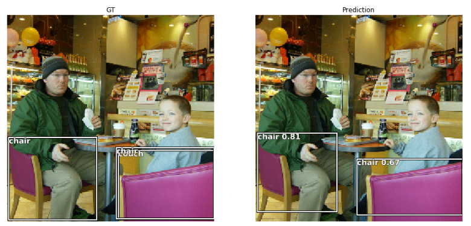
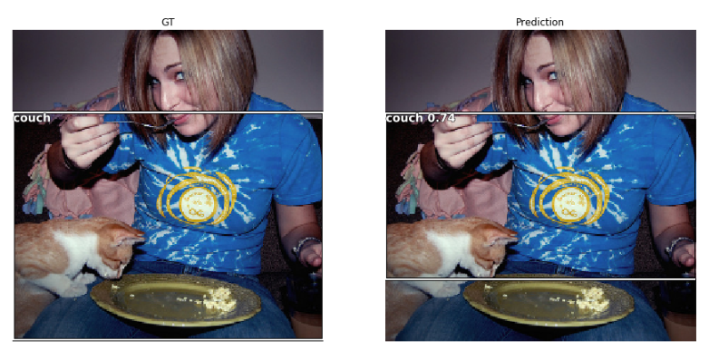
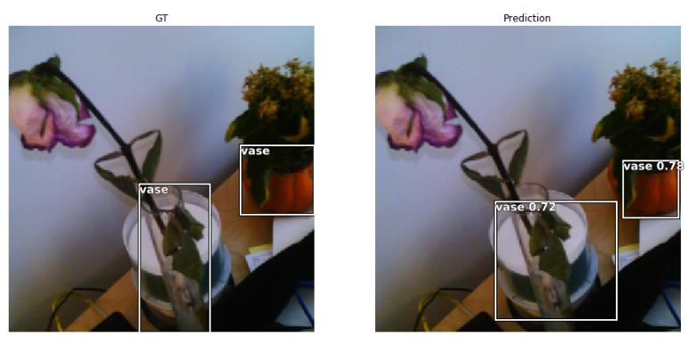
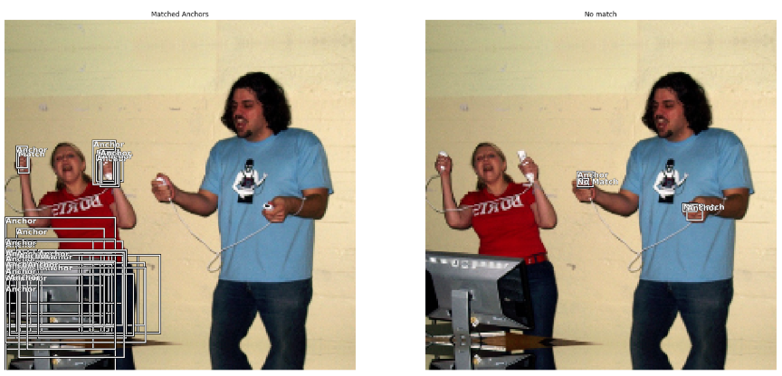

# ObjectDetection
Some experiments with object detection in PyTorch and FastAi.
This repo is created just for educational reasons.
But if you like it please let me know.

# Examples:
[Medical images](examples/Cells_Retina_Net.ipynb)
[Coco subset](examples/CocoTiny_Retina_Net.ipynb)

# Results:






# Features:

[x] Coco Metric at train time

[x] Flexibility
```python
# use the feature map sizes 32,18,8,4 with 32 channels and two conv layers for detection and classification
RetinaNet(encoder, n_classes=data.train_ds.c, n_anchors=18, sizes=[32,16,8,4], chs=32, final_bias=-4., n_conv=2)
'''
  (classifier): Sequential(
    (0): Sequential(
      (0): Conv2d(32, 32, kernel_size=(3, 3), stride=(1, 1), padding=(1, 1))
      (1): ReLU()
    )
    (1): Sequential(
      (0): Conv2d(32, 32, kernel_size=(3, 3), stride=(1, 1), padding=(1, 1))
      (1): ReLU()
    )
    (2): Conv2d(32, 18, kernel_size=(3, 3), stride=(1, 1), padding=(1, 1))
  )
```

```python
# use the feature map sizes 32 with 8 channels and three conv layers for detection and classification
RetinaNet(encoder, n_classes=data.train_ds.c, n_anchors=3, sizes=[32], chs=8, final_bias=-4., n_conv=3)
```

[x] Debug anchor matches for training
On the left image we see objects that are represented by anchors.
On the right objects with no corresponding anchors for training.

The size of the smallest anchors should be further decreased to match the small objects on the right image.