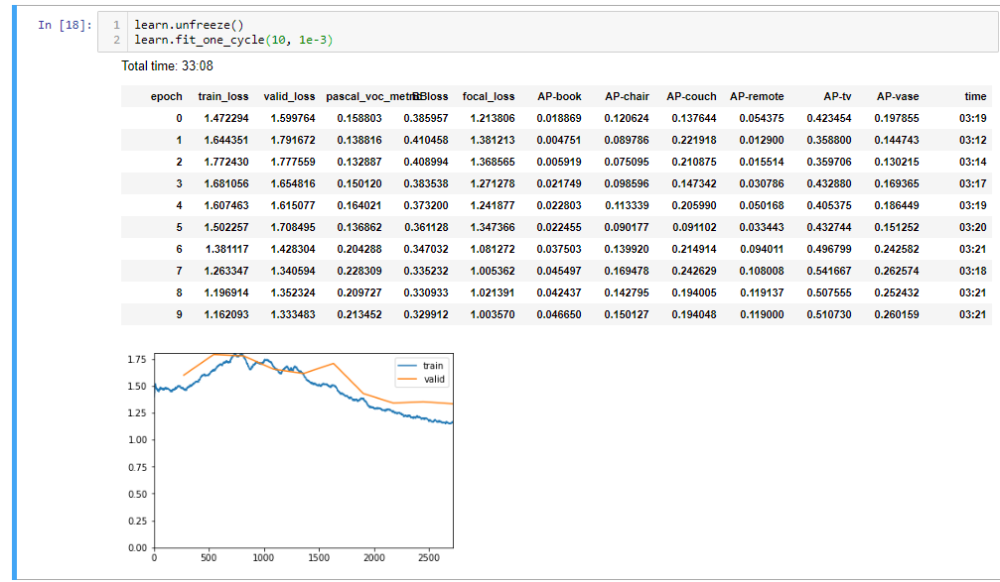

# ObjectDetection
Some experiments with object detection in PyTorch and [FastAi](https://www.fast.ai/).
This repo is created for educational reasons and to get a deeper understanding of [RetinaNet](https://arxiv.org/abs/1708.02002) and object detection general. If you like it, please let me know, if you find any bugs or tips for improvements also. 

# Install

```
pip install object-detection-fastai
```

Test: [Coco Colab](https://colab.research.google.com/drive/1qUEy1w8uYT2PQhan77RIn8NhfE_bMk63)

# Update old code

```python
# Old imports:
from helper.object_detection_helper import *
from loss.RetinaNetFocalLoss import RetinaNetFocalLoss
from models.RetinaNet import RetinaNet
from callbacks.callbacks import BBLossMetrics, BBMetrics, PascalVOCMetric

# New imports
from object_detection_fastai.helper.object_detection_helper import *
from object_detection_fastai.loss.RetinaNetFocalLoss import RetinaNetFocalLoss
from object_detection_fastai.models.RetinaNet import RetinaNet
from object_detection_fastai.callbacks.callbacks import BBLossMetrics, BBMetrics, PascalVOCMetric
```


[](https://www.youtube.com/watch?v=xCcdVgV1rRA "RetinaNet WSI")

The basline for this notebook was created by [Sylvain Gugger](https://github.com/sgugger) from FastAi [DevNotebook](https://github.com/fastai/fastai_docs/blob/master/dev_nb/102a_coco.ipynb). Thank you very much, it was a great starting point and I'm a big fan off your work.


# Publications using this code:

[x] [Deep Learning-Based Quantification of Pulmonary Hemosiderophages in Cytology Slides](https://arxiv.org/abs/1908.04767)

# Examples:
- [Medical images](object_detection_fastai/examples/Cells_Retina_Net.ipynb)
- [Coco subset](object_detection_fastai/examples/CocoTiny_Retina_Net.ipynb)
- [Coco Colab](object_detection_fastai/https://colab.research.google.com/drive/1qUEy1w8uYT2PQhan77RIn8NhfE_bMk63)

# Results:


# Features:

[x] Coco Metric at train time via callback 

[x] Flexibility
```python
# use the feature map sizes 32,18,8,4 with 32 channels and two conv layers for detection and classification
RetinaNet(encoder, n_classes=data.train_ds.c, n_anchors=18, sizes=[32,16,8,4], chs=32, final_bias=-4., n_conv=2)
'''
  (classifier): Sequential(
    (0): Sequential(
      (0): Conv2d(32, 32, kernel_size=(3, 3), stride=(1, 1), padding=(1, 1))
      (1): ReLU()
    )
    (1): Sequential(
      (0): Conv2d(32, 32, kernel_size=(3, 3), stride=(1, 1), padding=(1, 1))
      (1): ReLU()
    )
    (2): Conv2d(32, 18, kernel_size=(3, 3), stride=(1, 1), padding=(1, 1))
  )
```

```python
# use the feature map sizes 32 with 8 channels and three conv layers for detection and classification
RetinaNet(encoder, n_classes=data.train_ds.c, n_anchors=3, sizes=[32], chs=8, final_bias=-4., n_conv=3)
```

[x] Debug anchor matches for training.


On the left image we see objects that are represented by anchors.
On the right objects with no corresponding anchors for training.

The size of the smallest anchors should be further decreased to match the small objects on the right image.
